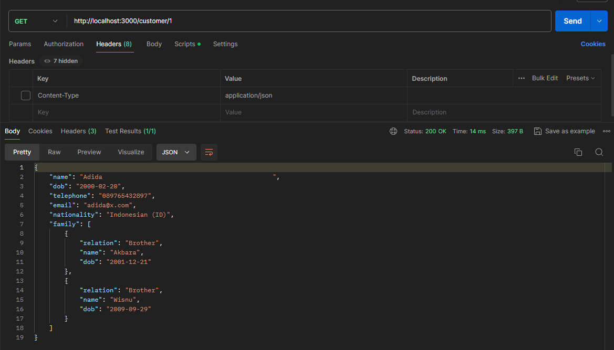
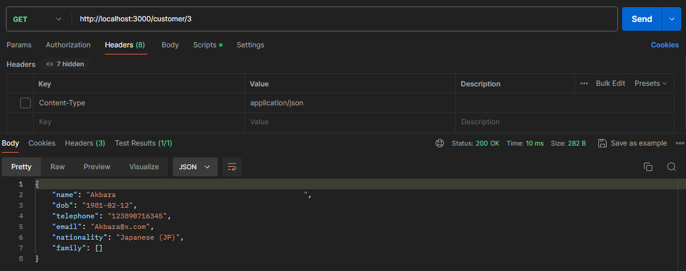

# Submission BookingToGo

A tech test BookingToGo using :

<p align="center"><a href="https://go.dev" target="_blank"></a></p>

## Requirements

BookingToGo is currently extended with the following requirements.  
Instructions on how to use them in your own application are linked below.

| Requirement | Version |
| ----------- | ------- |
| Go          | 1.21.5  |
| Postgres    | 14.10.^ |

## Installation

Make sure the requirements above already install on your system.  
Clone the project to your directory and install the dependencies.

```bash
$ git clone https://github.com/wisnuuakbr/booking-to-go-golang
$ cd booking-to-go-golang
$ go mod tidy
```

## Configuration

Copy the .env.example file and rename it to .env  
Change the config for your local server

```bash
DB_HOST     = localhost
DB_PORT     = 5432
DB_USER     = postgres
DB_PASSWORD = postgres
DB_NAME     = booking_to_go_v1
```

## Running Server

```bash
$ cd .\cmd\
$ go run .\main.go
```

## Output




